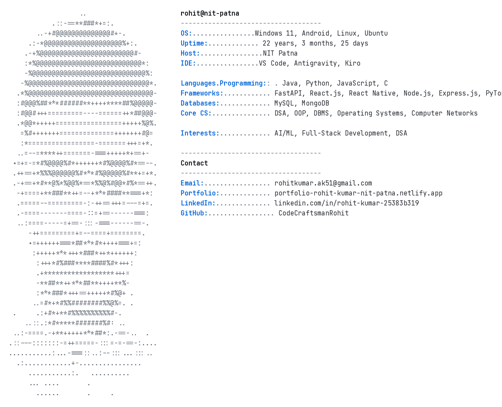

<h1 align="center">Hi 👋, I'm Rohit Kumar</h1>

<h3 align="center">
Final-year B.Tech CSE @ NIT Patna | Amazon ML Summer School '26 |
AI/ML • Backend • Full-Stack Developer
</h3>

  <picture>
    <source media="(prefers-color-scheme: dark)" srcset="assets/fetch_dark.png">
    <source media="(prefers-color-scheme: light)" srcset="assets/fetch_light.png">
    
  </picture>

---

## 🚀 About Me

- 🎓 Final-year **B.Tech in Computer Science & Engineering** at **NIT Patna** (CGPA: **8.30**)
- 🏆 Selected for **Amazon ML Summer School 2026**
- 💼 Former **SDE Intern @ Erpixo**, building ERP mobile applications using **React Native (Expo)** and **GraphQL**
- 🧠 Passionate about **Software Engineering, AI/ML, Backend, and Full-Stack Development**
- 🛠️ Built projects spanning **Generative AI, Deep Learning, Web Development, and Mobile Applications**
- 📈 Competitive Programmer on **LeetCode, CodeChef, and Codeforces**
- 📫 Open to **Software Development Engineer (SDE), Backend, Full-Stack, and AI/ML** opportunities

---

## 🛠️ Tech Stack

  
  
  
  
  
  
  
  
  
  
  
  
  
  
  
  
  

---

## ⭐ Featured Projects

### 🛡️ [Inherently Robust PE Malware Detection Engine](https://github.com/CodeCraftsmanRohit/Robust-Malware-Detection-Autoencoder)

*Adversarial Deep Learning • Research*

- Engineered a deep-learning pipeline for PE malware classification achieving **85.57%** accuracy.
- Designed a **Denoising Shield** architecture combining Autoencoders with Dense Neural Networks for adversarial robustness.
- Maintained **65.17%** accuracy under **FGSM** and **PGD** adversarial attacks.
- Authored a research paper exploring adversarial machine learning defenses.

---

### 🛒 [Amazon NOW AI](https://github.com/CodeCraftsmanRohit/Amazon_NOW)

*AI-Powered Conversational Commerce Platform*

- Built an AI shopping assistant using **FastAPI, Next.js, GPT-4o, and LangChain** that converts natural-language shopping intent into personalized shopping carts in **2–4 seconds**.
- Designed an AI reasoning pipeline featuring **product graph traversal**, **purchase-history personalization**, **budget optimization**, and **hallucination-safe catalog validation**.
- Implemented **Voice AI**, **Vision AI**, weather-aware recommendations, Smart Saver discounts, and one-click checkout.
- Architected a scalable backend with provider-agnostic LLM support, automated testing, and deployment-ready system design.

---

## 🏆 Achievements & Certifications

- 🥇 Amazon ML Summer School 2026
- 💯 NPTEL Human-Computer Interaction — **100/100 (Elite)**
- 🧩 **LeetCode:** Max Rating **1673**
- ⭐ **CodeChef:** 2★ (Max Rating **1416**)
- 🚀 **Codeforces:** Max Rating **355**
- 📜 Oracle Certified GenAI
- 📜 Oracle AI Foundation
- 📜 Agentic AI with Python

---

## 🌱 Currently Learning

- System Design(HLD+LLD)
- Generative Agentic AI
- Competitive Programming

---

## 🌐 Connect With Me

  

  

  

---

## 📊 GitHub Stats

